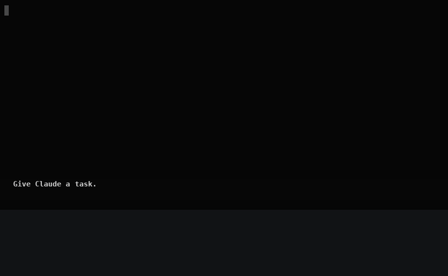

# prompt-shelf

[](https://www.npmjs.com/package/prompt-shelf)
[](LICENSE)
[](package.json)
[](https://github.com/sourabhshegane/prompt-shelf)

**Stash multiple prompts for later in Claude Code and Codex CLI.** You're
halfway through a prompt and something else needs saying first: a quick
question, a new idea, or Claude is heading the wrong way and needs steering.
Press `Ctrl+F` to put the draft on the shelf, say what matters now, and press
`Ctrl+Q` to bring the draft back when you're ready. **Keep as many drafts on
the shelf as you like**, and they survive closing the session.



## Why not Claude Code's `Ctrl+S`?

| | Claude `Ctrl+S` | prompt-shelf |
| --- | --- | --- |
| Drafts it holds | 1 | as many as you want |
| Survives closing the session | no | yes |
| Shared across repos | no | yes, filtered to the current repo by default |
| Search | no | yes (`/` in the list) |

The same keys work in Codex CLI too, and both agents share one shelf.

## Install

```bash
npm i -g prompt-shelf
```

- **Use `-g`.** Without it, npm installs prompt-shelf into the current folder
  and nothing changes for `claude` or `codex`.
- **Open a new terminal tab**, then run `claude` or `codex` exactly as you always
  have. Tabs that were already open won't pick it up.
- Check it with `stash doctor`: it should say `on PATH: yes` and
  `claude: shim installed`.

Requires Node 20 or newer. Installing puts a small `claude` / `codex` shim in
`~/.prompt-shelf/bin/` and adds that folder to the front of your PATH with one
marked line in your shell rc file (`~/.zshrc`, `~/.bashrc` or
`~/.config/fish/config.fish`). All of the agent's own arguments still work,
e.g. `claude --resume`.

## Keys

While you're typing in Claude Code or Codex:

| Key | What it does |
| --- | --- |
| `Ctrl+F` | Stash what's in the box and clear it |
| `Ctrl+Q` | Open the stash list. Whatever you've typed stays in the box |

In the list:

| Key | What it does |
| --- | --- |
| `↑` `↓` or `j` `k` | Move |
| `Enter` | Unstash: add the entry to the box (on a new line after your text) and remove it from the stash |
| `a` | Same, but keep it in the stash |
| `d` then `y` | Delete the entry |
| `/` | Search; `Esc` clears it |
| `Tab` | Switch between this repo's entries and all of them |
| `Esc`, `q`, `Ctrl+C`, `Ctrl+F` or `Ctrl+Q` | Close the list |

Pasted a long block that shows up as `[Pasted text #1 +12 lines]` (Claude) or
`[Pasted Content 1500 chars]` (Codex)? `Ctrl+F` still saves the full text, not
the placeholder.

prompt-shelf takes over `Ctrl+F` and `Ctrl+Q` while the agent runs. In Claude
Code `Ctrl+F` normally moves the cursor right one character (the arrow key
does the same). Pick other keys with `stash hotkey` if you use them.

Both keys can be changed, to `ctrl+<letter>` or `f1`–`f12`:

```bash
stash hotkey f2        # stash key
stash hotkey list f3   # list key
stash hotkey           # show both
```

## Commands

| Command | What it does |
| --- | --- |
| `stash list [--all]` | Print this repo's entries (`--all`: every repo) |
| `stash add <text>` | Stash text from the command line |
| `stash pop [n] [--all]` | Print entry `n` (1 = newest) and remove it |
| `stash rm <n> [--all]` | Remove entry `n` |
| `stash hotkey [list] [key]` | Show or change the hotkeys |
| `stash doctor` | Check the shims, PATH and where the real agents live |
| `stash enable` / `stash disable` | Add or remove the shims and the PATH line |
| `stash claude` / `stash codex` | Run an agent through the wrapper explicitly |
| `STASH_OFF=1 claude` | Run the real agent without the wrapper |

## Troubleshooting

| What you see | Fix |
| --- | --- |
| `Ctrl+F` does nothing | You're in a tab or an agent session that was open before you installed. Open a new tab and start `claude` again. |
| `stash: command not found` | It was installed without `-g`. Run `npm i -g prompt-shelf` (and `npm rm prompt-shelf` in the folder where you ran it without `-g`). |
| `stash doctor` says `on PATH: no` | Add the line it prints to your shell rc file and open a new tab. |
| `stash doctor` says `claude: shim missing` | Claude Code wasn't on your PATH when you installed. Run `stash enable`. |
| Your terminal already uses `Ctrl+F` or `Ctrl+Q` | Pick other keys: `stash hotkey f2`, `stash hotkey list f3`. |
| You want the agent without prompt-shelf, once | `STASH_OFF=1 claude` |

## Uninstall

```bash
stash disable          # optional: removes the shims and the PATH line
npm rm -g prompt-shelf
```

Skipping `stash disable` is fine: the shims fall through to the real
`claude` / `codex` when `stash` is gone.

## Supported

| | Status |
| --- | --- |
| Claude Code | Tested on macOS |
| Codex CLI | Tested on macOS |

## How it works

`claude` resolves to a shim that runs `stash claude`. prompt-shelf starts the
real `claude` in a pseudo-terminal and passes your keystrokes and its output
straight through, so the agent behaves exactly as it would on its own. On the
side it keeps a copy of the screen, and a small per-agent adapter reads the
input box from it when you press `Ctrl+F`. Unstashing pastes the text back in
as a normal paste. Nothing is ever sent to the agent for you.

Entries live in `~/.prompt-shelf/stash.jsonl` and settings in
`~/.prompt-shelf/config.json`.

## Caveats

- If an agent changes how its input box looks, `Ctrl+F` may stop reading it.
  When that happens it says "nothing to stash" and never clears anything it
  couldn't read.
- Long lines the agent wraps on screen are joined back with a space. In a very
  narrow terminal a wrap can occasionally come back as a line break.
- On a Mac keyboard the F-keys are media keys by default, so an `f2` hotkey
  means pressing `Fn+F2`.

## Roadmap and contributing

See [ROADMAP.md](ROADMAP.md) for what's next (a prompt library with groups,
more agents) and [CONTRIBUTING.md](CONTRIBUTING.md) to help out.

## License

MIT
